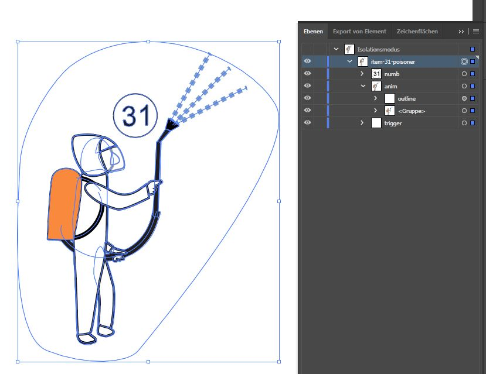
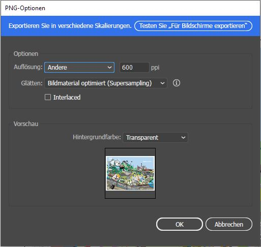
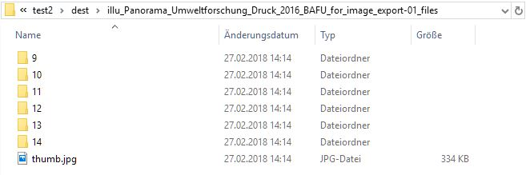

# Panorama Update Anleitung

> Das Panorama ist mit JavaScript, HTML, CSS und JSON aufgebaut.

## Inhaltsanpassung
Anpassungen am Inhalt oder Tooltip sind schnell gemacht. Tooltip Texte können in der Datei [/data/shape.translation.json](/data/shape.translation.json) angepasst werden. Dazu kann ein beliebiger Texteditor verwendet werden. Die Objekte sind wie folgt aufgebaut:
- `id` => Eindeutige Id der Gruppe aus dem SVG
- `number` => Nummer aus dem Konzept
- `de` => Deutscher Text für Tooltip
- `fr` => Französischer Text für Tooltip
- `cat_de` => Deutscher Text für Tooltip Kategorie
- `cat_fr` => Französischer Text für Tooltip Kategorie
- `content` => Name der Datei im Ordner [/data/content/](/data/content/) ohne Sprache (de/fr) und `.html`

Inhaltstexte sind als HTML Datei gespeichert und können unter [/data/content/](/data/content/) auf Deutsch und Französisch bearbeitet werden.
Die verlinkten Bilder sind unter [/data/content/img/](/data/content/img/) abgelegt.

## Panorama Update
Wenn auf dem Panorama neue Elemente hinzugefügt, gelöscht oder geändert werden, sind die Anpassungen sehr aufwendig.

Zuerst müssen die neuen Elemente in der Datei [/data/panorama_umweltforschung.svg](/data/panorama_umweltforschung.svg) hinzugefügt werden. Dazu öffnet man die Datei z.B. mit Adobe Illustrator und macht die nötigen visuellen Änderung.

Anschliessend müssen die Elemente diesen Vorgaben entsprechend gruppiert und betitelt werden (`outline` und `trigger` müssen extra erstellt werden):
- Gruppe für ganzes Element `item-[Nummer]-[eindeutige Bezeichnung]`
- Element/Gruppe für Hover und Klick Auslöser `trigger` (Trigger können von Hand erstellt werden)
- Gruppe für schwarze Outline `outline` (Outlines können entweder mit dem Pathfinder Tool erstellt werden oder von Hand)
- Gruppe für animierte Teile `anim`
- Gruppe für Nummer `numb`



Anschliessend sollte auch die Datei [/data/shape.translation.json](/data/shape.translation.json) auf nötige Änderungen überprüft werden, damit die Verknüpfung zwischen der Illustration und den Inhalten weiter funktioniert.

Nun kommt der komplizierteste Teil des Prozesses. Die gelieferte Vektor Illustration muss zuerst so angepasst werden, dass Elemente, welche bereits auf dem SVG sichtbar sind (z.B. animiert), gelöscht werden. Wenn alles angepasst ist, muss die Illustration als hochaufgelöstes PNG (600ppi) exportiert werden.
> Das neue Bild muss unbedingt gleich gross sein wie das alte Bild!



Anschliessend muss die PNG Datei in ein JPG umgewandelt werden (z.B. mit Adobe Photoshop).

Die JPG Datei muss anschliessend mit dem [Tile Generator](http://labs.webcodingstudio.com/tilegenerator/) ([Download](http://labs.webcodingstudio.com/uploads/php/tilegenerator.zip)) in viele kleine Bilder zerstückelt werden.

Der Tile Generator ist eine PHP Anwendung die auf jedem Server mit PHP Umgebung (auch XAMPP/localhost) gehostet werden kann. Dabei muss darauf geachtet werden, dass PHP `php.ini` so konfiguriert ist, dass auch grosse Bilder verarbeitet werden können:
- `upload_max_filesize = 100M`
- `post_max_size = 100M`
- `memory_limit = 300M`
- [GD- und Image-Funktionen](https://secure.php.net/manual/de/ref.image.php) müssen aktiviert sein

Wenn alles installiert und konfiguriert ist, kann die JPG Datei über die Weboberfläche hochgeladen werden. Anschliessend findet man die zerstückelten Bilder under `[Installationspfad]/dest/[Bildname]/`



Alle alten Ordner und Dateien aus diesem Ordner [/data/panorama_umweltforschung_files/](/data/panorama_umweltforschung_files/) können gelöscht und durch die neu generierten ersetzt werden.

Falls neue Animationen hinzugefügt werden, muss jetzt noch die [/css/style.css](/css/style.css) angepasst werden.
Dazu müssen die entsprechenden Keyframes erstellt und dem Element zugewiesen werden.

```css
#item-31-poisoner .anim {
  transform-origin: 50% 100%;
  transform-box: fill-box;
  animation: wiggle 10s linear alternate infinite;
}

@keyframes wiggle {
  0%, 6%, 12%, 18%, 24%, 30% {
    transform: rotate(3deg);
  }
  3%, 9%, 15%, 21%, 27% {
    transform: rotate(-3deg);
  }
  100% {
    transform: rotate(3deg);
  }
}

```
